# Blog Creator System - Complete Flow Diagrams

This document contains the complete logic process flow of the blog creator system from frontend to backend and vice versa.

## 1. Frontend Initialization & User Journey


## 2. Blog Generation Process (Frontend → Backend)


## 3. Backend API Processing Flow

```mermaid
graph TD
    A[POST /api/blog/generate] --> B[Extract Request Body]
    B --> C[Validate Required Fields]
    C --> D[Resolve Field Names (New/Old)]
    D --> E[Check API Key Configuration]
    E --> F[Process Images if Provided]
    F --> G[Select Model Configuration]
    G --> H[Build Dynamic Prompt]
    H --> I[Add Strategic Plan Instructions]
    I --> J[Add Image Integration Instructions]
    J --> K[Call NVIDIA API]
    K --> L[Process AI Response]
    L --> M[Return Structured Response]
    M --> N[POST /api/blog/save]
    N --> O[Validate Blog Data]
    O --> P[Save to MongoDB]
    P --> Q[Return Success/Error]
```

## 4. Strategic Planning Flow


## 5. Topic Recommendations Flow


## 6. Result View & User Actions

```mermaid
graph TD
    A[BlogCreatorResult Component] --> B[Display Generated Blog]
    B --> C[Render with Image Integration]
    C --> D[Show Blog Details Panel]
    D --> E[User Actions Available]
    E --> F[Copy Content]
    E --> G[Export Blog]
    E --> H[Edit Content]
    E --> I[Regenerate Blog]
    E --> J[Back to Form]
    
    F --> K[copyToClipboard Function]
    G --> L[exportBlog Function]
    H --> M[Toggle Edit Mode]
    I --> N[Call generateBlogPost Again]
    J --> O[Switch Back to Guidance View]
    
    K --> P[Clean Content & Copy to Clipboard]
    L --> Q[Create JSON Export File]
    M --> R[Show Textarea for Editing]
    N --> S[Repeat Generation Process]
    O --> T[Reset Form State]
```



## 7. Data Flow Architecture


## 8. Error Handling & Fallbacks


## 9. State Management Flow


## 10. Component Interaction Flow

```mermaid
graph TD
    A[App.js] --> B[BlogCreator Component]
    B --> C[BlogCreatorGuidance Component]
    B --> D[BlogCreatorResult Component]
    
    C --> E[Step Navigation]
    C --> F[Form Validation]
    C --> G[API Calls]
    C --> H[State Management]
    
    D --> I[Content Display]
    D --> J[User Actions]
    D --> K[Export Functions]
    D --> L[Edit Mode]
    
    G --> M[/api/blog/plan]
    G --> N[/api/blog/topic-recommendations]
    G --> O[/api/blog/generate]
    G --> P[/api/blog/save]
```

## 11. API Endpoints Overview


## 12. Complete Request-Response Cycle

### Frontend Request Structure
```javascript
const requestData = {
  topic: "Our New Seasonal Menu Launch",
  mainName: "Downtown Bistro",
  type: "business",
  industry: "Food & Beverage",
  location: "Downtown Seattle",
  targetAudience: "customers",
  tone: "enthusiastic",
  length: "medium",
  keyPoints: "• Highlight our commitment to local ingredients...",
  specialFeatures: "• Recently won 'Best New Restaurant 2024'...",
  images: [/* image data */],
  strategicPlan: "PRIMARY GOAL: Increase customer engagement..."
};
```

### Backend Response Structure
```javascript
const response = {
  success: true,
  blogPost: "# Our New Seasonal Menu Launch ✨\n\nWelcome to Downtown Bistro...",
  wordCount: 850,
  model: "nvidia/llama-3.3-nemotron-super-49b-v1",
  imageAnalysis: {
    totalImages: 3,
    imageDetails: [/* image analysis */],
    integrationSuggestions: [/* suggestions */]
  },
  metadata: {
    topic: "Our New Seasonal Menu Launch",
    mainName: "Downtown Bistro",
    // ... all metadata
  }
};
```

## 13. Key Integration Points

✅ **Multi-Step Form Validation** - Each step validates before proceeding  
✅ **AI Model Selection** - Dynamic model selection based on content length  
✅ **Image Processing** - Automatic image analysis and integration  
✅ **Strategic Planning** - Goal-driven content strategy generation  
✅ **Topic Recommendations** - Context-aware topic suggestions  
✅ **Error Handling** - Comprehensive error handling with fallbacks  
✅ **Data Persistence** - Dual storage (localStorage + MongoDB)  
✅ **Export Functionality** - Complete blog export with metadata  
✅ **Edit Capabilities** - In-place content editing and saving  
✅ **Responsive Design** - Mobile-friendly interface  

## Export Instructions

### For Mermaid Live Editor:
1. Copy any diagram code block (between ```mermaid and ```)
2. Go to https://mermaid.live/
3. Paste the code in the editor
4. Export as PNG, SVG, or PDF

### For Documentation:
1. Use these diagrams in Markdown files
2. GitHub and GitLab support Mermaid rendering
3. Many documentation platforms support Mermaid

### For Presentations:
1. Export as SVG for best quality
2. Import into presentation software
3. Use as reference for system architecture discussions

---

*This documentation provides a complete overview of the blog creator system's flow and can be used for development, maintenance, and onboarding purposes.* 