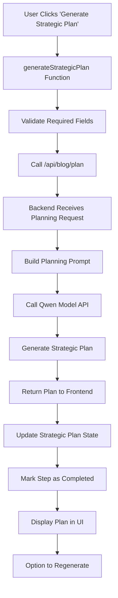

# 4. Strategic Planning Flow


```mermaid
graph TD
    A[User Clicks 'Generate Strategic Plan'] --> B[generateStrategicPlan Function]
    B --> C[Validate Required Fields]
    C --> D[Call /api/blog/plan]
    D --> E[Backend Receives Planning Request]
    E --> F[Build Planning Prompt]
    F --> G[Call Qwen Model API]
    G --> H[Generate Strategic Plan]
    H --> I[Return Plan to Frontend]
    I --> J[Update Strategic Plan State]
    J --> K[Mark Step as Completed]
    K --> L[Display Plan in UI]
    L --> M[Option to Regenerate]
```

**Export Instructions:**
1. Copy the code between ```mermaid and ```
2. Go to https://mermaid.live/
3. Paste and export as PNG/SVG/PDF 