# Social Media Post System - Complete Logic Flow Diagram

## 🎯 System Overview

The Social Media Post system is a comprehensive content generation and management platform that provides both guided (Wizard) and advanced modes for creating optimized social media content across multiple platforms.

## 📊 Main Flow Architecture

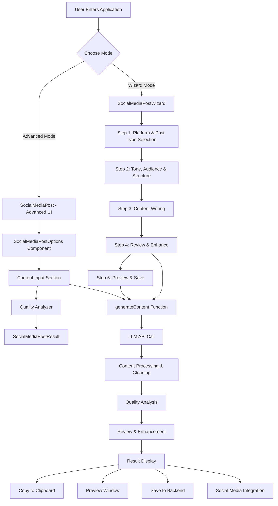

## 🔄 Detailed Component Flow

### 1. Entry Point & Mode Selection

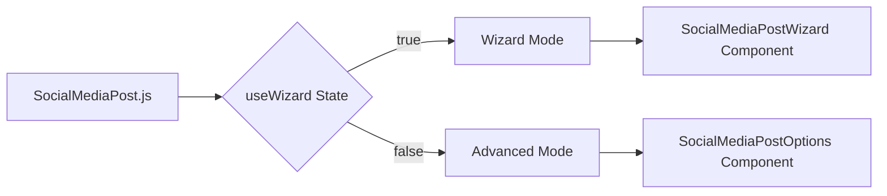

### 2. Wizard Mode Flow (5 Steps)

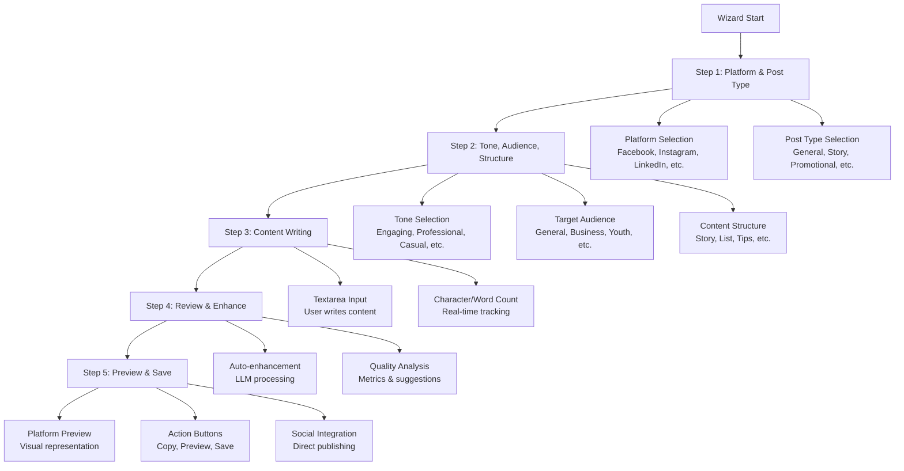

### 3. Advanced Mode Flow

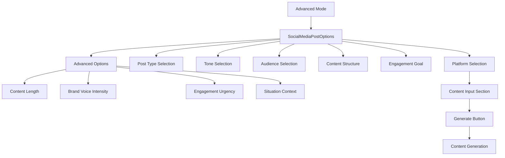

### 4. Content Generation Process

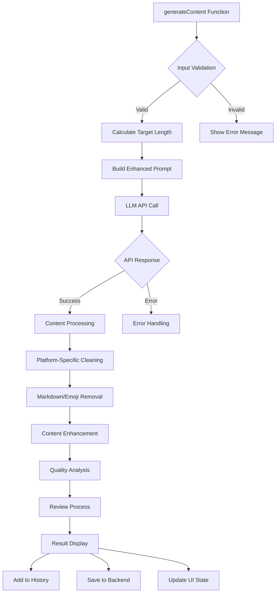

### 5. Content Processing & Enhancement

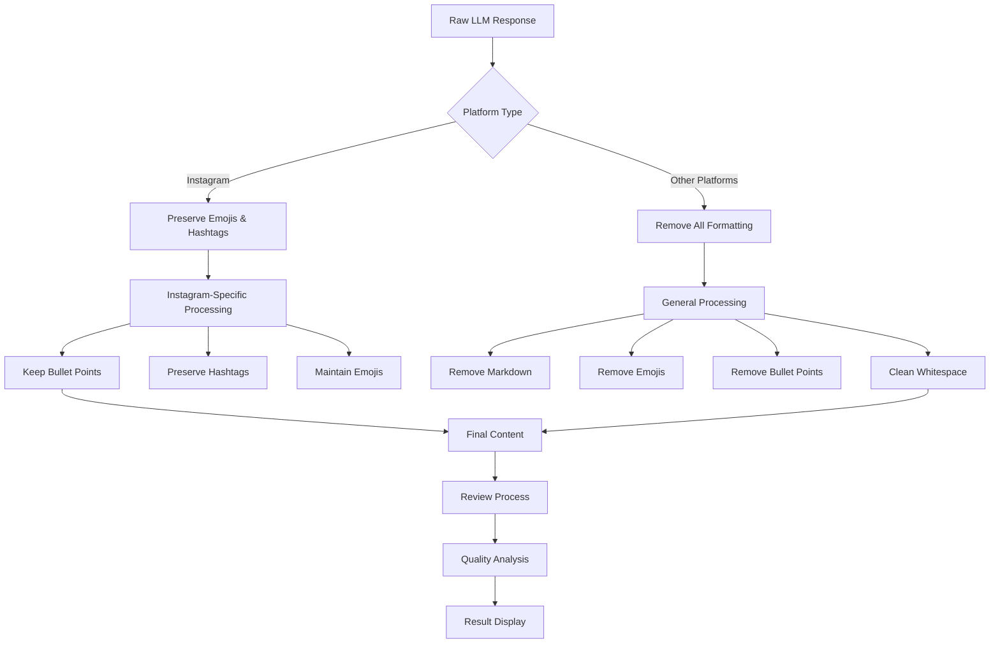

### 6. Quality Analysis System

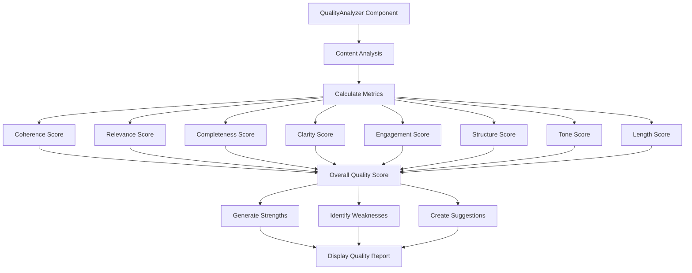

### 7. Result Display & Actions

```mermaid
graph TD
    A[SocialMediaPostResult Component] --> B[Platform-Specific Preview]
    B --> C[Facebook Preview]
    B --> D[Instagram Preview]
    B --> E[LinkedIn Preview]
    B --> F[Twitter Preview]
    B --> G[TikTok Preview]
    B --> H[YouTube Preview]
    
    A --> I[Quality Analysis Display]
    I --> J[Quality Score]
    I --> K[Strengths & Weaknesses]
    I --> L[Recommendations]
    
    A --> M[Action Buttons]
    M --> N[Copy to Clipboard]
    M --> O[Preview Window]
    M --> P[Save Post]
    M --> Q[Download JSON]
    
    A --> R[Content Editor]
    R --> S[Quick Edit Textarea]
    R --> T[Character Count]
    
    A --> U[Comparison Tools]
    U --> V[Show Original]
    U --> W[Show Comparison]
    
    A --> X[Social Media Integration]
    X --> Y[Direct Publishing]
```

### 8. Data Flow & State Management

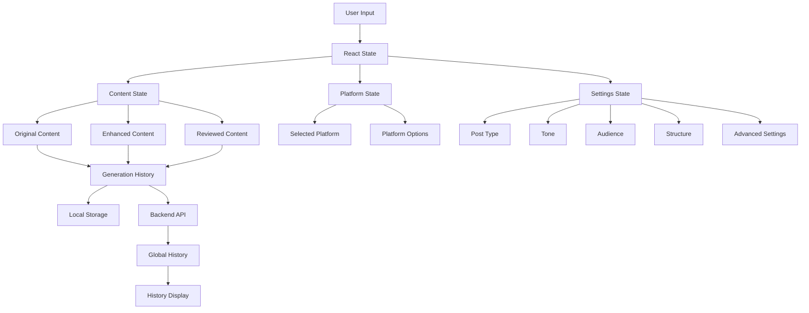

### 9. API Integration Flow

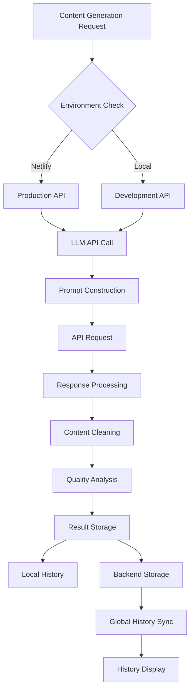

### 10. Error Handling & Fallbacks

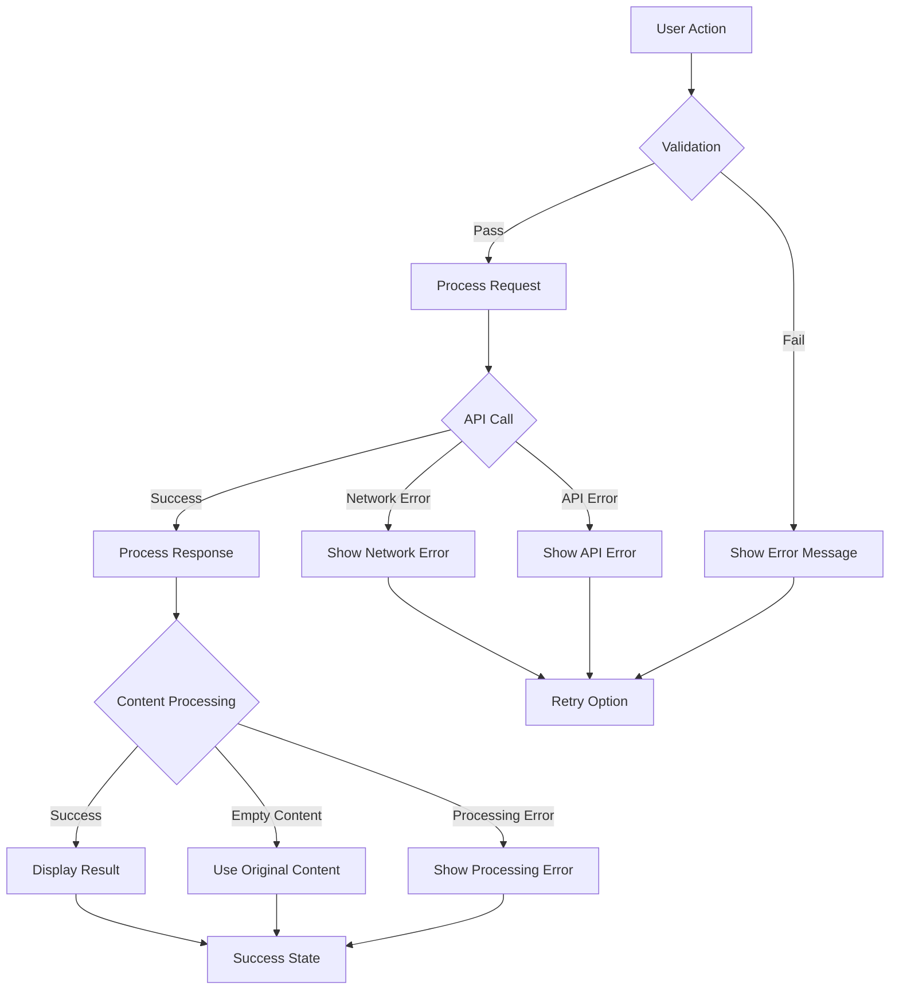

## 🎨 UI Component Hierarchy

```
SocialMediaPost (Main Container)
├── Mode Toggle (Wizard/Advanced)
├── SocialMediaPostWizard (Wizard Mode)
│   ├── Progress Indicator
│   ├── Step Content
│   │   ├── Step 1: Platform & Post Type
│   │   ├── Step 2: Tone, Audience, Structure
│   │   ├── Step 3: Content Writing
│   │   ├── Step 4: Review & Enhance
│   │   └── Step 5: Preview & Save
│   ├── Tips Panel
│   └── Navigation Buttons
└── Advanced Mode Components
    ├── SocialMediaPostOptions
    ├── Content Input Section
    ├── QualityAnalyzer
    └── SocialMediaPostResult
        ├── Platform Preview
        ├── Quality Analysis
        ├── Action Buttons
        ├── Content Editor
        ├── Comparison Tools
        └── Social Media Integration
```

## 🔧 Key Functions & Their Purposes

### Core Functions
- `generateContent()`: Main content generation orchestrator
- `calculateTargetLength()`: Dynamic length calculation based on platform and settings
- `reviewGeneratedContent()`: LLM-based content review and cleaning
- `analyzeQuality()`: Content quality assessment
- `openPreviewWindow()`: Platform-specific preview generation
- `copyToClipboard()`: Content copying functionality

### Platform-Specific Functions
- `getContentLengths()`: Platform-specific length options
- `getPostTypes()`: Platform-specific post types
- `getTones()`: Platform-specific tone options
- `getAudiences()`: Platform-specific audience options
- `getContentStructures()`: Platform-specific structure options
- `getEngagementGoals()`: Platform-specific engagement goals

### Utility Functions
- `formatInstagramContent()`: Instagram-specific formatting
- `getQualityColor()`: Quality score color coding
- `getQualityLabel()`: Quality score labeling
- `groupHistoryByPlatform()`: History organization
- `savePostToBackend()`: Backend data persistence

## 📱 Mobile Responsiveness

The system includes comprehensive mobile optimization:
- Responsive design for all screen sizes
- Touch-friendly interface elements
- Collapsible panels for mobile
- Optimized navigation for small screens
- Mobile-specific preview layouts

## 🔄 State Management

### Primary States
- `content`: Original user input
- `enhancedContent`: LLM-generated content
- `reviewedContent`: Final cleaned content
- `platform`: Selected social media platform
- `postType`: Type of post being created
- `tone`: Content tone/style
- `targetAudience`: Target audience
- `isGenerating`: Generation status
- `isReviewing`: Review status
- `qualityAnalysis`: Quality metrics

### Advanced States
- `contentLength`: Target content length
- `brandVoiceIntensity`: Brand voice strength
- `engagementUrgency`: Engagement urgency level
- `situation`: Context/situation
- `showAdvancedOptions`: Advanced options visibility
- `generationHistory`: Local generation history
- `globalHistory`: Backend history

## 🎯 Key Features Summary

1. **Dual Mode Interface**: Wizard (guided) and Advanced (expert) modes
2. **Multi-Platform Support**: Facebook, Instagram, LinkedIn, Twitter, TikTok, YouTube
3. **Dynamic Content Generation**: AI-powered content enhancement
4. **Quality Analysis**: Comprehensive content quality assessment
5. **Platform-Specific Optimization**: Tailored content for each platform
6. **Real-time Preview**: Visual preview of posts on target platforms
7. **Content History**: Local and global content history management
8. **Social Media Integration**: Direct publishing capabilities
9. **Mobile Optimization**: Fully responsive design
10. **Advanced Customization**: Fine-grained control over content parameters

This comprehensive system provides a complete solution for social media content creation, from initial ideation to final publication, with robust quality assurance and platform optimization throughout the process. 